```{r setup, include=FALSE}
knitr::opts_chunk$set(echo = FALSE)

library(knitr)
```

# Count 

```{r out.width="50%"}
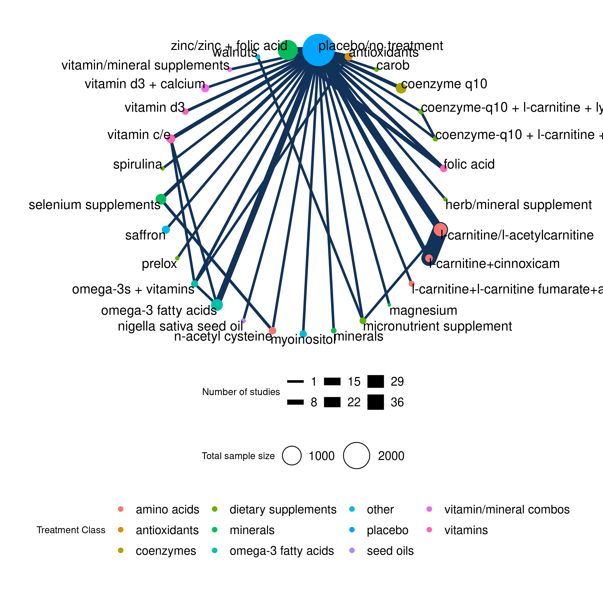
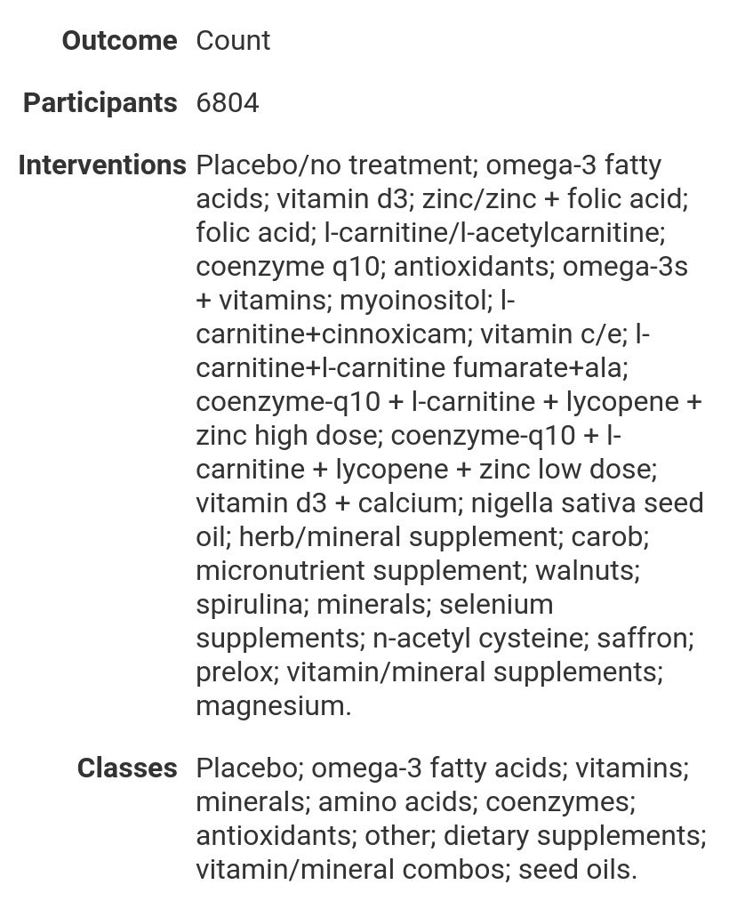

```

```{r}
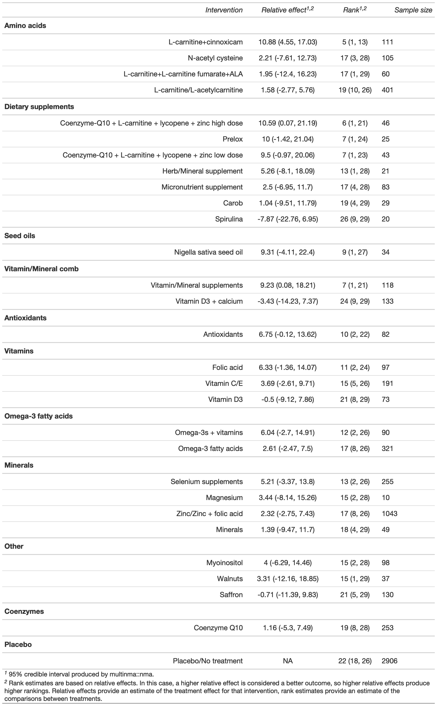
```


# Volume 

```{r out.width="50%"}
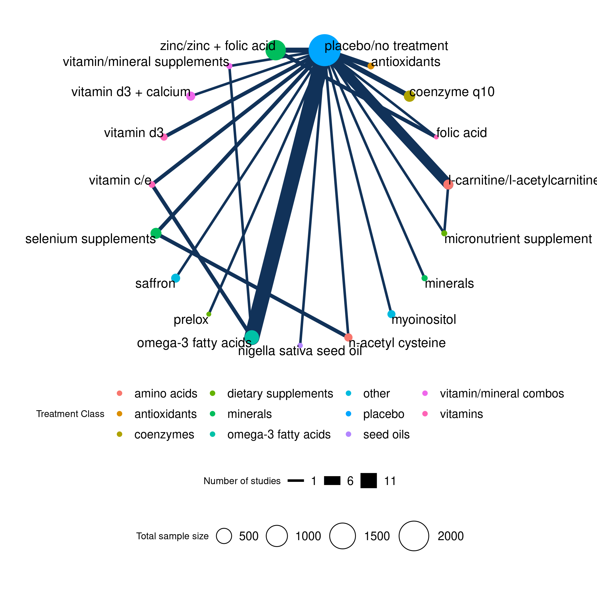
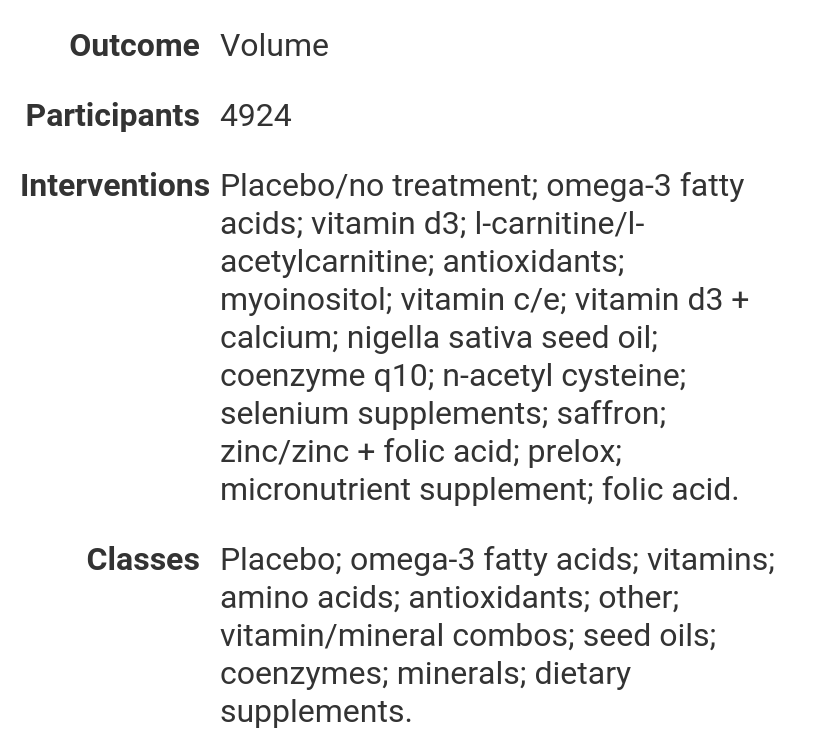

```

```{r}
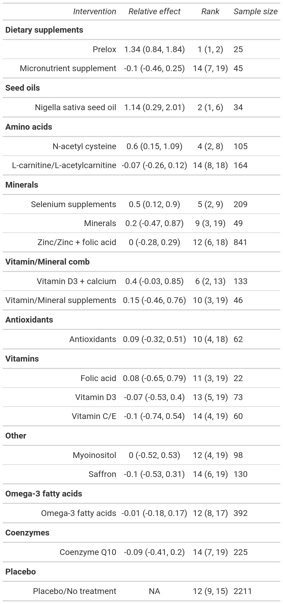
```


# Morphology 

```{r out.width="50%"}
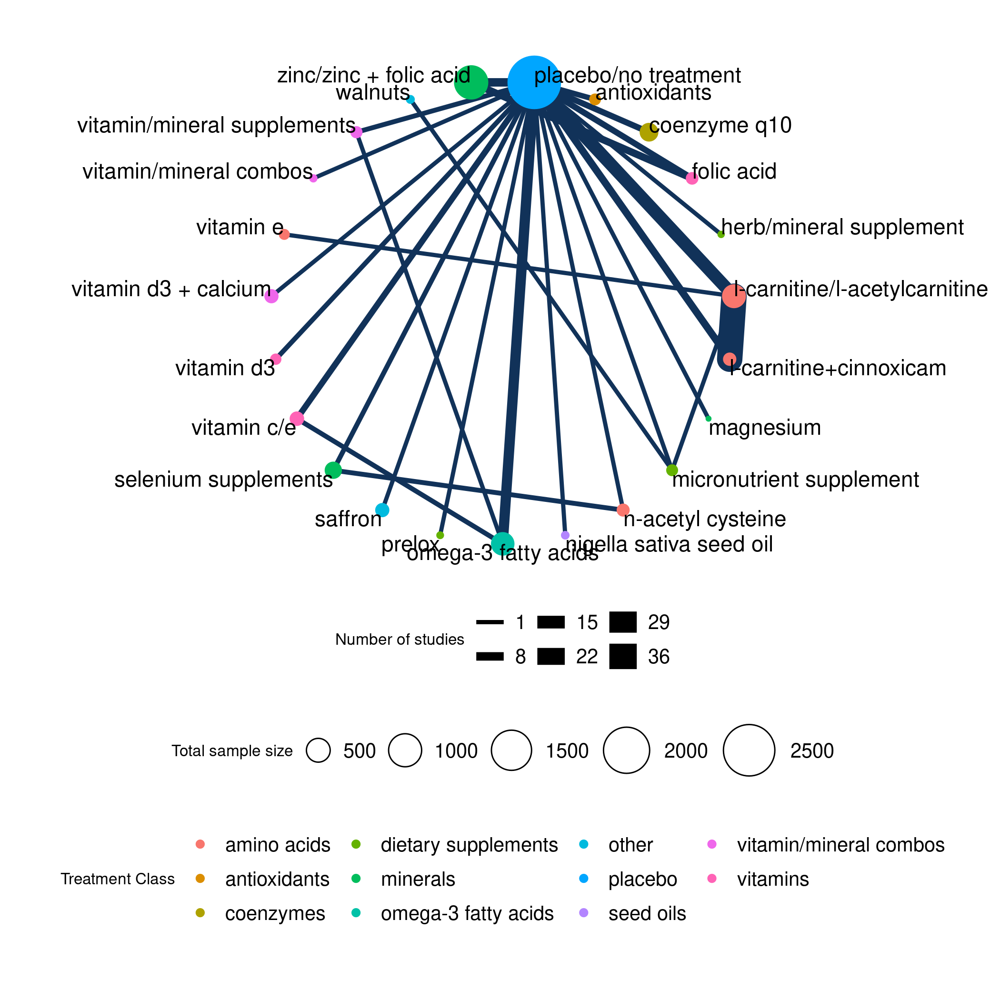
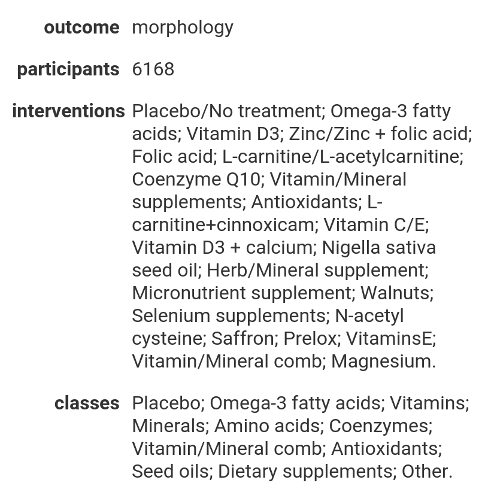

```

```{r}
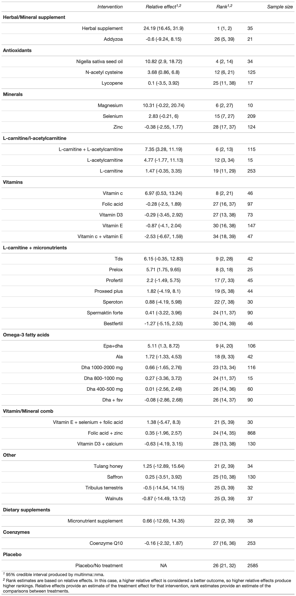
```


# Motility 

```{r out.width="50%"}
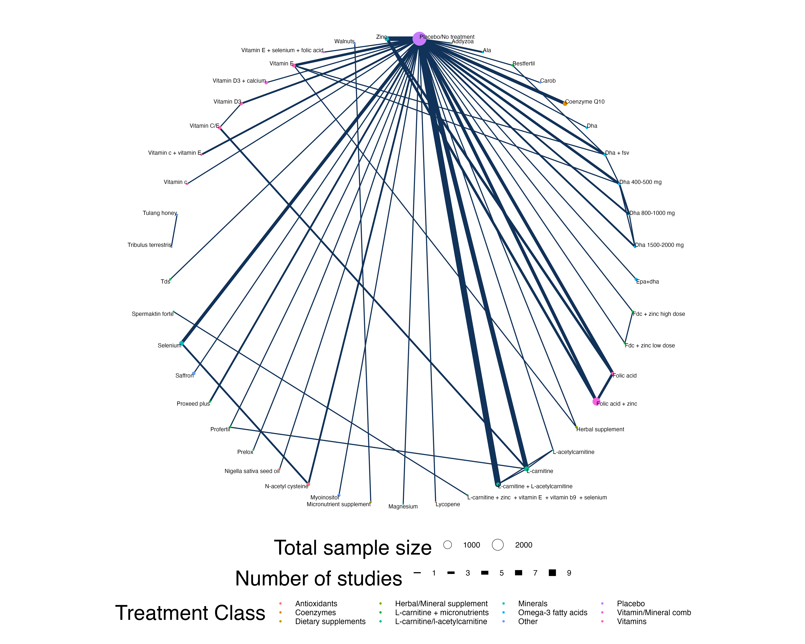
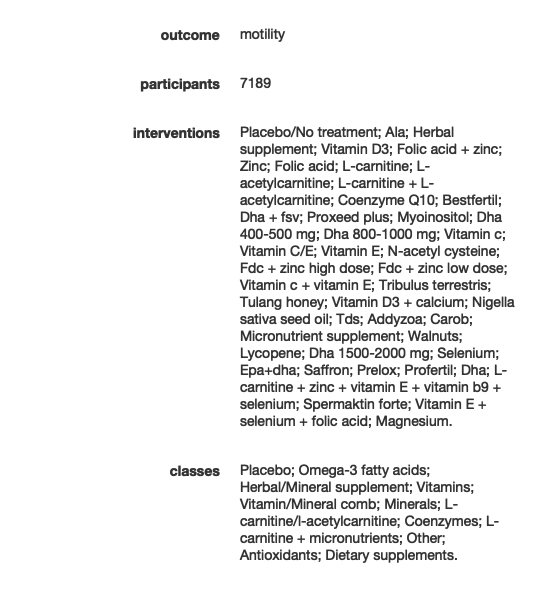

```

```{r}
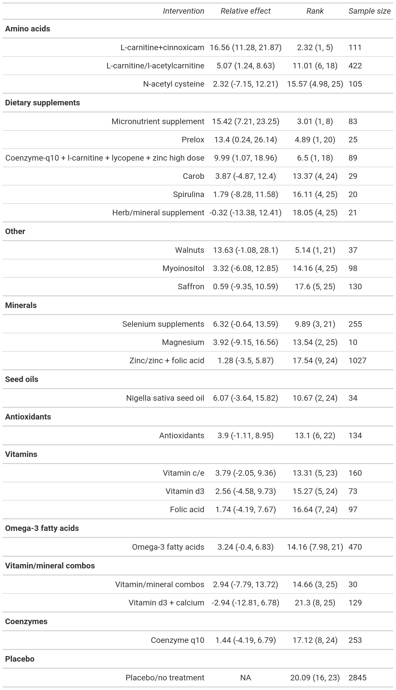
```
